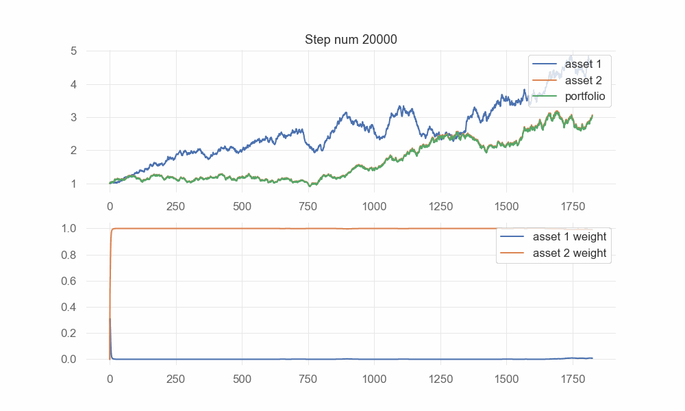

# rl-gbm

This repository contains codes of my mini-experiments about reinforcement learning on stochastic processes about asset prices and real asset prices.

This repo will be updated when I try something new.

## Requirements

```
numpy
pandas
pytorch
matplotlib
seaborn
```

## Algorithm

### DDPG

To train a policy with DDPG, run ```python ddpg.py```.

To evaluate checkpoints, run ```python ddpg_eval.py```.

To see some samples of the performance of checkpoints, run ```python ddpg_eval_xxx.py```. To evaluate the performance under GBM environment, ```xxx``` is ```plot```; to evaluate the performance under real price, ```xxx``` is ```real```; to evaluate the performance under a environment that the trend of underlying assets are swaped, ```xxx``` is ```swap```.

*Note: to run ```ddpg_eval_real.py```, download, unzip [data](http://www.immchallenge.org/mcm/2022_Problem_C_DATA.zip) and put it under ```data``` directory.*

